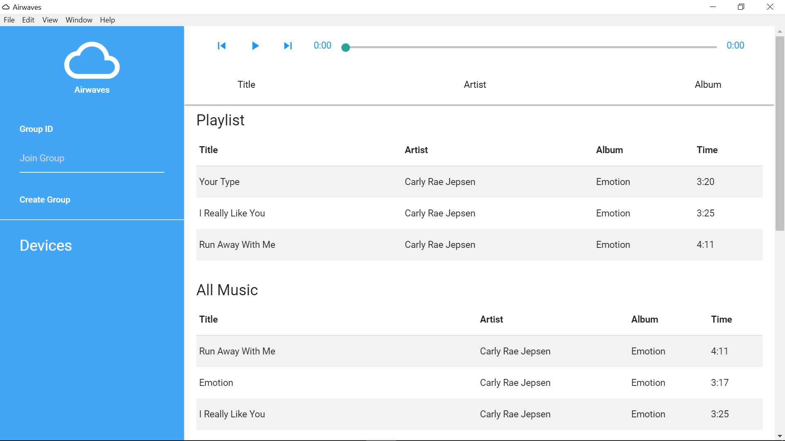

# app

> Electron app for airwaves, a software to sync music across multiple devices to allow for a distributed speaker network. Able to sync both the playing and the audio files.




## Dev

```
$ npm install
```

### Run
Ensure the [airwaves server](https://github.com/shihern/airwaves-server) is running. Then change ```SYNC_URL``` in ```index.js``` to point to the server URL before running.

```
$ npm start
```

### Build

```
$ npm run build
```

Builds the app for macOS, Linux, and Windows, using [electron-packager](https://github.com/electron-userland/electron-packager).
